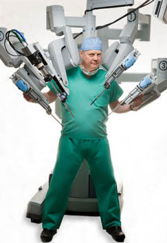
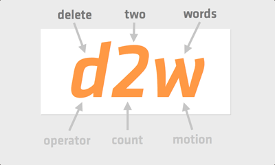

!SLIDE smbullets incremental
# Vim is a Modal Editor

* **Normal:** Stealthily leap from line to line, over sentences, leaving no trace like a **NINJA**
* **Insert:** Type text. Boring.
* **Visual:** Select text with the precision of a surgeon

!SLIDE center
# **A ROBOT-ASSISTED SURGEON**

!SLIDE smbullets
# Ninja (Normal) Mode

* 

!SLIDE smbullets
# Ninja Motion
* `w` move to the next word: he[l]lo world `=>` hello [w]orld
* `fo` find char `o`: he[l]lo world `=>` hell[o] world

!SLIDE smbullets
# Ninja Motion
* `dw` delete to the next word: he[l]lo world `=>` he[w]orld
* `dfo` delete find char `o`: he[l]lo world `=>` he[ ]world

!SLIDE smbullets
# Ninja Motion
* `d2w` delete to the second word: he[l]lo world leaders `=>` he[l]eaders
* `d2fo` delete find char `o`: he[l]lo world `=>` he[r]ld

!SLIDE smbullets
# Ninja Text Objects
* `aw` a word: he[l]lo world `=>` [hello ]world
* `iw` inner word: he[l]lo world `=>` [hello] world

!SLIDE smbullets
# Ninja Text Objects
* `caw` change a word: he[l]lo world `=>` |world
* `ciw` change inner word: he[l]lo world `=>` | world

!SLIDE smbullets
# Ninja Text Objects
* `ca"` change a quoted string: hello "[w]orld" `=>` hello|
* `ci"` change inner quoted string: hello "[w]orld" `=>` hello "|"

!SLIDE smbullets
# Ninja Text Objects
* `:h navigation`
* `:h text-objects`

!SLIDE
# WARNING
## A very small percentage of people may experience a seizure when exposed to certain visual images, including the next slide. Even people who have no history of seizures or epilepsy may have an undiagnosed condition that can cause these "vim-overload epileptic seizures".

## **Immediately stop and switch to and idiot-proof editor like Emacs.**

!SLIDE center
# Vim Cheat Sheet

