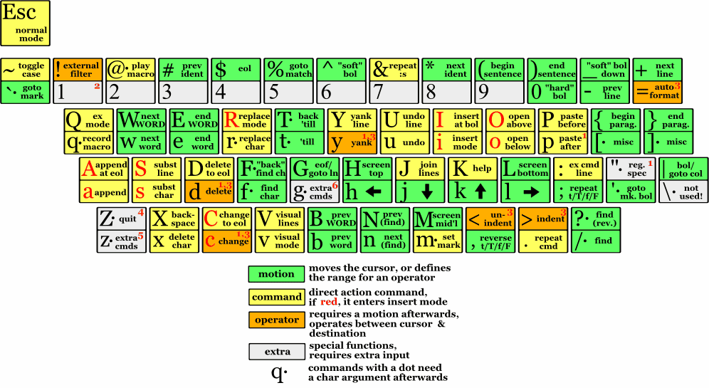

!SLIDE smbullets incremental
# Vim is a Modal Editor

* **Normal:** Stealthily leap from line to line, over sentences, leaving no trace like a **NINJA**
* **Insert:** Type text. Boring.
* **Visual:** Select text with the precision of a **ROBOT-ASSISTED SURGEON**
* 

!SLIDE smbullets incremental
# Ninja (Normal) Mode

* 
* `dw` delete a word
* `7j` move 7 lines down
* `=ip` indent the paragraph
* `C` delete the rest of the line and enter insert mode

!SLIDE
# WARNING
## A very small percentage of people may experience a seizure when exposed to certain visual images, including the next slide. Even people who have no history of seizures or epilepsy may have an undiagnosed condition that can cause these "vim-overload epileptic seizures".

## **Immediately stop and switch to and idiot-proof editor like Emacs.**

!SLIDE center
# Vim Cheat Sheet

